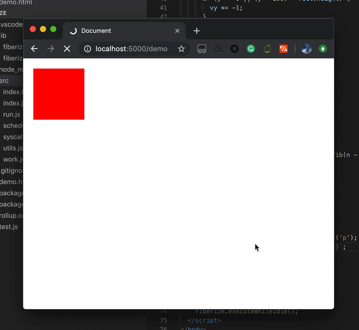

# Fiberize

The PoC for a library to help us create cooperative programs using JavaScript.



## Demo

For a intuitive feeling, clone this repo and run it:

```
$ npm i
```

then:

```
$ npm test
```

And there is also a browser version, run this:

```
$ npm run build && open ./demo.html
```

## Prior Art

**React Fiber** introduced an approach that can make the diffing process interruptible. The idea behind it is to use a looping-based algorithm to replace the old stack-based algorithm. A loop is much easier to jump out because the callstack is not deep (and there is literally no `setjmp`/`longjmp` in JavaScript). And to make the works resumable, we need a new data structure to record which stage we were processing, that is what `Fiber` does.

`Fiber` is pretty like a *linked-tree*, and is just a plain-old-JavaScript-object. It has `child`, `sibling` and `return` pointers to keep track each of its relationships.

## A Glance of the Fiberize

```javascript
const { run, executeWhileIdle } = require('fiberize');

function* fib(n) {
  if (n <= 2) {
    return 1;
  }

  return (yield fib(n - 1)) + (yield fib(n - 2));
}

function* main() {
  for (let i = 1; i < 40; i++) {
    const res = yield fib(i);
    console.log(res);
  }
}

run(main());
executeWhileIdle();

console.log('Back to main.');
setInterval(function () {
  console.log('Main loop is still alive!!');
}, 1000);
```

When you run this, you should see the program keeps printing the fibonacci results, while the main loop is still ready to response (the timer is working).

## Behind the Scene

If you take a look at the `executeWhileIdle` function:

```javascript
export function executeWhileIdle() {
  if (!executeUntilDeadline(Date.now() + 10)) {
    setTimeout(executeWhileIdle, 0);
  }
}
```

You'll find that we limit the work that can only be executing before a deadline (in this case, 10ms).

To make a long-term work interruptible, we must divide it in to small pieces. That is exactly what `yield` does. `yield`s in your code will suspend the underlying generator (aka. stackless coroutine, and that will save all the contexts for resuming the work) and return to our **scheduler code**.

The **scheduler** simply checks whether there is enough time to continue the work. If the time is up, `executeUntilDeadline` function will return with `false`, indicating that the work isn't done but there is no enough time to continue. Then, we will call `setTimeout` to request another opportunity to continue our works. After `setTimeout` is called, JavaScript event-loop is allowed to process its events and tasks such as I/O, timers, rendering, etc.

So, your long-term work and other code can be executing cooperatively, no more blocking.

### Tasks Dispatching

As you can see, the `fib` function in the demo above `yield` with another generator by calling `fib` itself. Regardless of the recursion, let's talk about what is happening when you do this.

What you `yield` is called a **syscall**, yeah, that's a metaphor: an instruction to the scheduler. And yielding an generator is just a syntactic sugar of `run` syscall.

A `run` syscall will put the current work into **wait state** (wait for the return value of the new work) and spawn a new work, when the new work is done, scheduler resumes the previously suspended work and send it the return value.

### Browser-Side Execution

Modern browsers provide an API called `requestIdleCallback`, which will give us a more precise deadline for each execution period. Combining the usage of `requestAnimationFrame`, we may be able to achieve task priorities.

## Further Research

Now the library only has a foundation and is obviously incomplete. To make it full-fledged, there is a to-do list:

- [ ] Improved scheduling algorithm.

The current algorithm is just simple "FCFS" (First-Come, First-Served). But most of operating systems may use "RR" (Round Robin) or priority scheduling. To make it, I may need to refactor the scheduler and design the work structure detailly.

- [ ] More concurrent primitive.

`run` syscall just make the caller work suspend, but there may be some scenarios that we need perform some works concurrently.

And there are some hypothetical syscalls we can implement:

* `spawn`
  * **Behavior:** similar to `run`, but will not suspend the caller.
  * **Parameters:** a generator.
  * **Returns:** an opaque handle to the spawned work.

* `join`
  * **Behavior:** put the caller into wait state until the given work is finished.
  * **Parameters:** a handle to work.
  * **Returns:** (TBD)

* `park`
  * **Behavior:** put the caller or a given work into wait state.
  * **Parameters:** a handle to work or `null` (represents self).
  * **Returns:** none

* `unpark`
  * **Behavior:** wake up the given work.
  * **Parameters:** a handle to work.
  * **Returns:** none

With those syscalls, we will have enough primitives to create higher level abstracts, like "Semaphore".

- [ ] Interactions between works and external environment.

In a work function, we can call external functions to interact with external environment. But that is not quite safe, and there are no ways to get to know the result of a work without doing that.

And we also need a way to get the self-information of a work. That's kinda like a set of syscalls without `yield` that directly return something about the current work.

- [ ] Work cancellation.

Cancel a single work is easy, but currently it's hard to cancel all the works it ran or spawned. A structure is needed to record the child works and resources related to a certain work.

- [ ] Parallel execution.

This feature is hard to implement in JavaScript and yet I don't have any idea of that. Comparing to *Golang*, we now have the **Processor** (P) and **Goroutines** (G) alternatives, but no **OSThread** (M) alternatives. Because JavaScript literally doesn't support multi-thread. **Web Workers** may not work due to the context isolation. So *Fiberize* is so far completely user-land green thread implementation.

## Contribution

This library is not targeted to production-use and will be slowly developed. If you are interested with it and want to standardize it, feel free to leave an issue and let me know.

## License

The Unlicense
